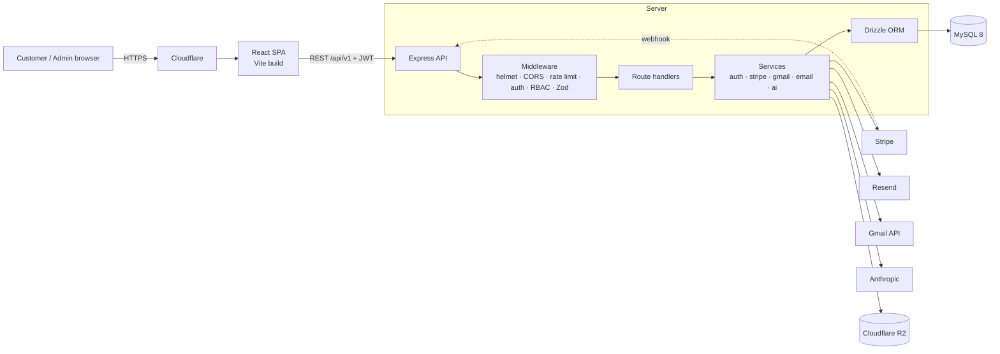
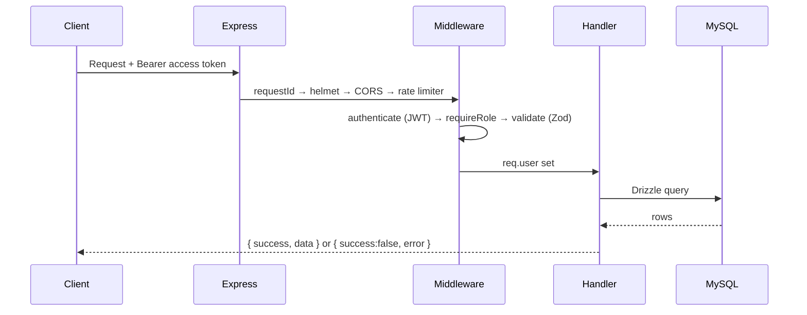
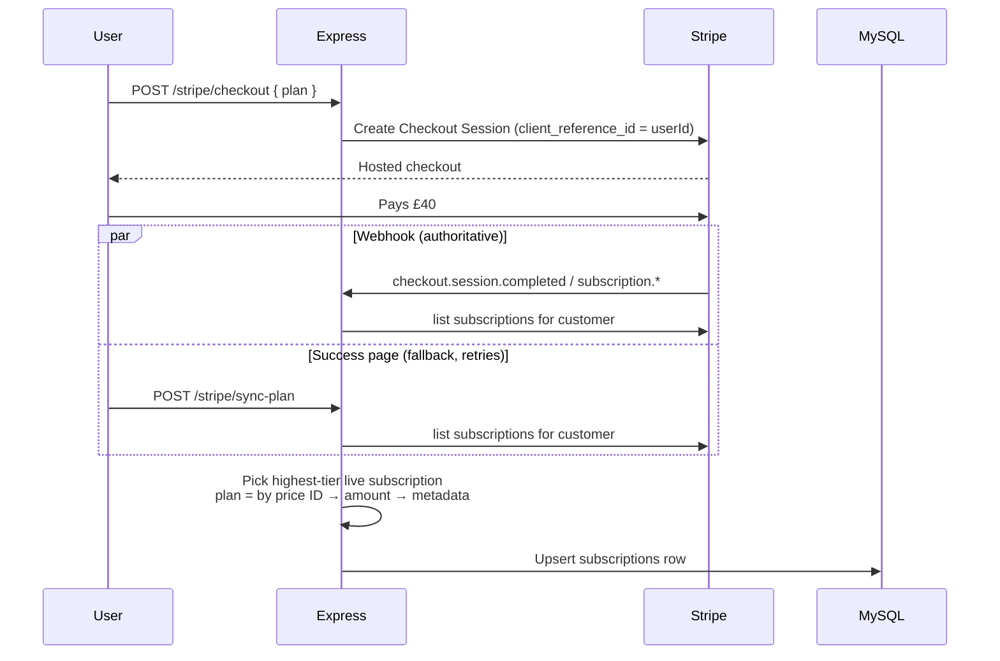
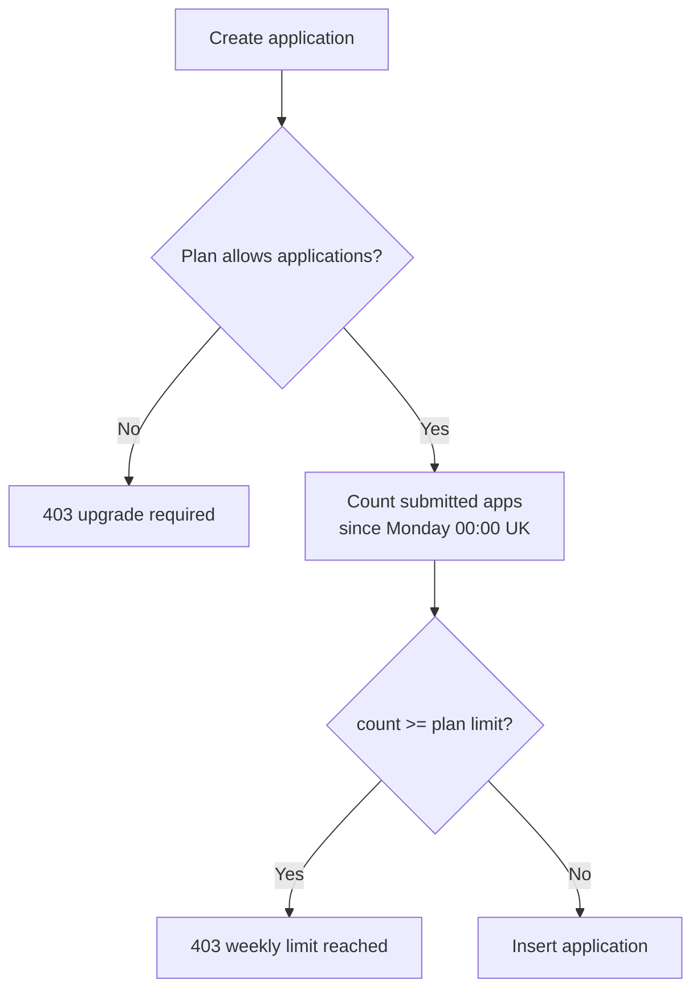
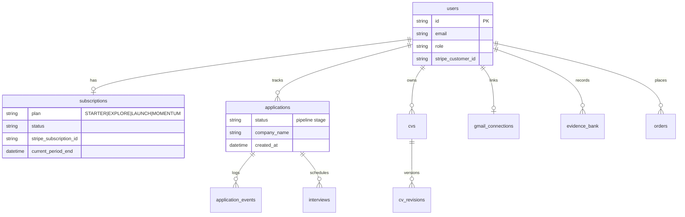

<div align="center">


# Campus to Corporate

**A career operating system for graduates: CV library, evidence bank, application pipeline, Gmail sync and managed job-search plans.**

[Live site](https://campustocorporate.co.uk) · [Full documentation](docs/DOCUMENTATION.md) · [Contact](mailto:success@campustocorporate.co.uk)


</div>

---

## Features

| For customers | For staff (admin) |
|---|---|
| CV library with review workflow | Customer list with plan, usage and "needs attention" flags |
| Evidence Bank of achievements | **Weekly Applications** view: per-customer counts per week, resetting Sunday midnight (UK) |
| Application pipeline (saved → applied → interviews → offer) | Task board for application work |
| Gmail sync that updates application statuses from email | Manual plan override and CV-review tracking |
| Stripe subscription plans with weekly application quotas | Role-based access (specialists, admins, super admins) |

## Plans

| Plan | Price / month | Applications / week | Extras |
|---|---|---|---|
| Starter | £0 | 0 | 1 CV change |
| Explore | £10 | 10 | |
| Launch | £20 | 50 | Unlimited CV changes, LinkedIn, 1 guaranteed interview/month |
| Momentum | £40 | 200 | Cover letters, multiple guaranteed interviews, dedicated specialist |

The plan is taken from the **Stripe price actually paid** (by price ID, falling back to amount), so paying £40 always results in Momentum. If a customer holds more than one live subscription, the highest tier wins.

## Tech stack

- **Client:** React 18, Vite, TypeScript, Tailwind, React Query, Zustand, React Router, Recharts, Framer Motion
- **Server:** Node.js, Express 4, TypeScript, Zod validation, Drizzle ORM
- **Data:** MySQL 8, Cloudflare R2 (files)
- **Integrations:** Stripe, Resend, Gmail API, Anthropic

## System design

### High-level architecture



### Request pipeline



Access tokens last 15 minutes; refresh tokens last 30 days and are rotated through `/auth/refresh`.

### Payment and plan flow



Both paths run the same `syncPlan`, so webhook ordering, a missing webhook (e.g. on localhost) or stale metadata cannot leave a customer on the wrong plan.

### Weekly application quota



Usage is **derived from real rows** in `applications` (excluding `SAVED` and `RECRUITER_OUTREACH`) rather than a stored counter, so it cannot drift. A week runs Monday 00:00 → Sunday 23:59:59 in `Europe/London` (DST aware, see `server/src/utils/week.ts`), so every customer's quota resets just after midnight on Sunday night. No cron job is needed. The admin **Weekly** page reads the same boundaries via `GET /api/v1/admin/weekly`.

### Data model



### Roles

`CUSTOMER` < `CAREER_SPECIALIST` / `CV_WRITER` / `APPLICATION_SPECIALIST` < `ADMIN` < `SUPER_ADMIN`. Higher levels pass lower-level checks; `/admin/*` needs `ADMIN` or above.

## Repository layout

```
campus-to-corporate/
├── client/                 React SPA
│   └── src/ pages · layouts · components · hooks · services · stores · config
├── server/
│   ├── server.ts           entry point
│   ├── drizzle/            SQL migrations
│   └── src/
│       ├── app.ts          Express app + security middleware
│       ├── routes/v1/      auth · applications · cvs · gmail · stripe · admin
│       ├── services/       business logic and third-party clients
│       ├── middleware/     auth · rbac · validate · rate limit · errors
│       ├── db/schema/      Drizzle table definitions
│       ├── config/         env (Zod-validated) · plan limits
│       └── utils/          week boundaries, JWT, crypto, errors
└── docs/                   detailed documentation
```

## Getting started

Requirements: Node 20+, MySQL 8.

```bash
npm install
cp server/.env.example server/.env   # fill in values
npm run db:migrate
npm run dev                          # client + server together
```

| Script | Purpose |
|---|---|
| `npm run dev` | Vite client and `tsx watch` server |
| `npm run build` | Build both workspaces |
| `npm run db:generate` / `db:migrate` / `db:studio` | Drizzle migrations and studio |

### Stripe setup

1. Create recurring prices (Explore £10, Launch £20, Momentum £40) and set `STRIPE_PRICE_EXPLORE`, `STRIPE_PRICE_LAUNCH`, `STRIPE_PRICE_MOMENTUM`.
2. Point a webhook at `/api/v1/stripe/webhook` with events `checkout.session.completed`, `customer.subscription.created`, `customer.subscription.updated`, `customer.subscription.deleted`, and set `STRIPE_WEBHOOK_SECRET`.
3. Locally, use `stripe listen --forward-to localhost:4000/api/v1/stripe/webhook`.

## Documentation

See [`docs/DOCUMENTATION.md`](docs/DOCUMENTATION.md) for the full API reference, environment variables and known issues.
